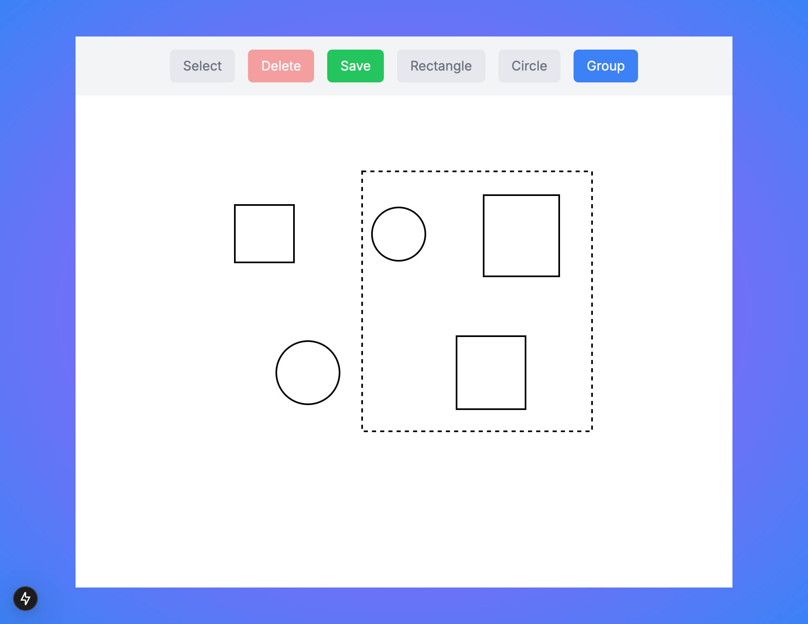

# Simple Drawing Tool



간단한 드로잉 툴입니다. Next.js, Redux Toolkit, Tailwind CSS를 사용하여 만들었습니다. SVG 형식으로 도형을 그릴 수 있습니다.

## 데모

[https://your-drawing-tool.vercel.app/](https://your-drawing-tool.vercel.app/)

## 주요 기능

*   **다양한 도형 그리기:** 사각형, 원, 점선 사각형을 그릴 수 있습니다.
*   **선택 및 이동:** 그려진 도형을 선택하고 드래그하여 이동할 수 있습니다.
*   **크기 조절:** 선택된 도형의 모서리 점을 드래그하여 크기를 조절할 수 있습니다.
*   **삭제:** 선택된 도형을 삭제할 수 있습니다.
*   **저장:** 캔버스에 그려진 내용을 PNG 파일로 저장할 수 있습니다.

## 기술 스택

*   [Next.js](https://nextjs.org/)
*   [Redux Toolkit](https://redux-toolkit.js.org/)
*   [Tailwind CSS](https://tailwindcss.com/)
*   [TypeScript](https://www.typescriptlang.org/)

## 설치 및 실행 방법

1.  저장소를 클론합니다.

    ```bash
    git clone https://github.com/your-username/your-repo.git
    ```

2.  프로젝트 디렉토리로 이동합니다.

    ```bash
    cd your-repo
    ```

3.  필요한 패키지를 설치합니다.

    ```bash
    npm install
    ```

4.  개발 서버를 실행합니다.

    ```bash
    npm run dev
    ```

5.  웹 브라우저에서 `http://localhost:3000`으로 접속합니다.

## 사용 방법

1.  툴바에서 원하는 도형을 선택합니다.
2.  캔버스에서 드래그하여 도형을 그립니다.
3.  "선택" 툴을 사용하여 도형을 선택하고 이동하거나 크기를 조절할 수 있습니다.
4.  "삭제" 버튼을 사용하여 선택된 도형을 삭제할 수 있습니다.
5.  "저장" 버튼을 사용하여 캔버스 내용을 PNG 파일로 저장할 수 있습니다.

## 폴더 구조
```
my-project/
├── src/
│ ├── app/
│ │ ├── globals.css
│ │ ├── layout.tsx
│ │ └── page.tsx
│ ├── features/
│ │ └── drawing-app/
│ │ ├── components/
│ │ │ ├── Canvas.tsx
│ │ │ ├── Toolbar.tsx
│ │ │ └── Shape.tsx
│ │ ├── redux/
│ │ │ ├── store.ts
│ │ │ ├── features/
│ │ │ │ └── drawingSlice.ts
│ │ │ └── hooks.ts
│ │ └── index.tsx
│ ├── utils/
│ │ └── helpers.ts
├── public/
│ └── ...
├── next.config.js
├── package.json
├── README.md
├── tsconfig.json
└── tailwind.config.js
```